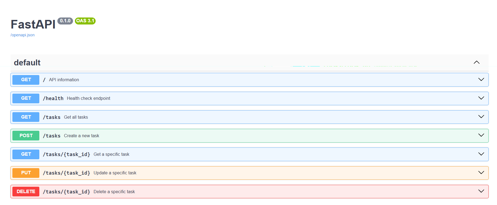

# Task API

A simple CRUD API built with FastAPI.

## Features

- Create Task
- Read All Tasks
- Read Task by ID
- Update Task
- Delete Task
- Swagger UI Documentation

## Installation

```bash
pip install -r requirements.txt
```

## Run

```bash
uvicorn main:app --reload
```

Open:

```
http://127.0.0.1:8000/docs
```

## Endpoints

| Method | Endpoint | Description |
|--------|----------|-------------|
| GET | / | API information |
| GET | /health | Health check |
| GET | /tasks | Get all tasks |
| GET | /tasks/{id} | Get task by ID |
| POST | /tasks | Create task |
| PUT | /tasks/{id} | Update task |
| DELETE | /tasks/{id} | Delete task |

## Example

```bash
curl -X POST http://127.0.0.1:8000/tasks \
-H "Content-Type: application/json" \
-d "{\"title\":\"Buy milk\"}"
```

## Swagger UI



