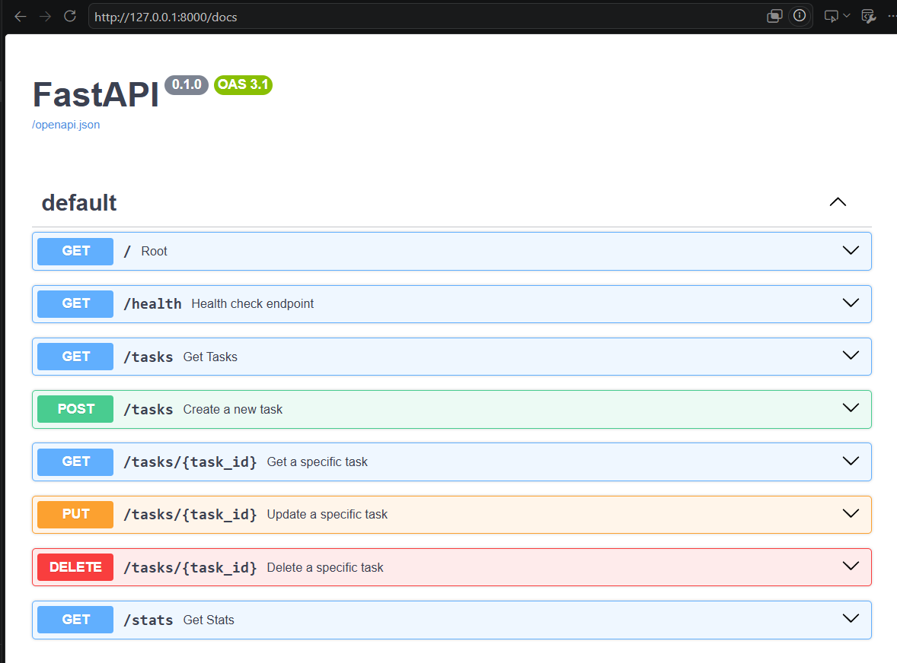
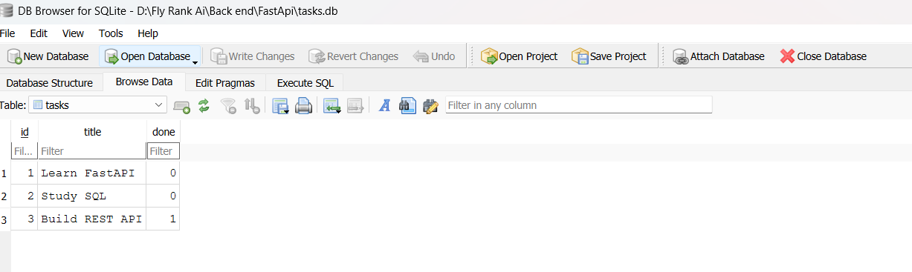

# Task API - SQLite Edition

A simple Task Management REST API built with FastAPI and SQLite.

## Features

- Create Task
- Read All Tasks
- Read Task by ID
- Update Task
- Delete Task
- Search Tasks
- Filter by Status
- Task Statistics
- SQLite Persistent Storage
- Swagger Documentation

---

## Technologies

- FastAPI
- SQLite
- Pydantic
- Uvicorn

---

## Installation

```bash
pip install -r requirements.txt
```

## Run

```bash
uvicorn main:app --reload
```

Open Swagger:

```
http://127.0.0.1:8000/docs
```

---

## Endpoints

| Method | Endpoint | Description |
|--------|----------|-------------|
| GET | / | Root |
| GET | /health | Health Check |
| GET | /tasks | Get all tasks |
| GET | /tasks/{id} | Get task |
| POST | /tasks | Create task |
| PUT | /tasks/{id} | Update task |
| DELETE | /tasks/{id} | Delete task |
| GET | /stats | Statistics |

---

## Query Parameters

```
GET /tasks?done=true
GET /tasks?done=false
GET /tasks?search=SQL
GET /tasks?done=true&search=FastAPI
```

---

## Persistence

The application now stores data in **SQLite (tasks.db)** instead of an in-memory list.

Tasks remain available after restarting the application.

---

## Screenshots



